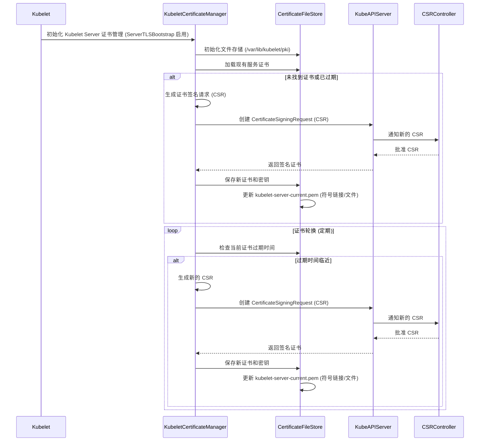

# Kubelet Server Certificate (`/var/lib/kubelet/pki/kubelet-server-current.pem`) 管理分析

本文档分析了 Kubernetes 项目中 Kubelet Server Certificate (`/var/lib/kubelet/pki/kubelet-server-current.pem`) 的管理、创建、更新、使用场景及其过期时间。分析基于 Kubernetes 源代码，特别是 `cmd/kubelet/app/server.go` 和 `pkg/kubelet/certificate/kubelet.go` 文件。

## 管理

Kubelet Server Certificate 由一个 `certificate.Manager` 实例管理，该实例通过 `pkg/kubelet/certificate/kubelet.go` 中的 `NewKubeletServerCertificateManager` 函数创建。这个管理器使用 `certificate.FileStore` 来处理证书和密钥文件在文件系统上的存储，通常在 `/var/lib/kubelet/pki` 目录下（或由 `--cert-dir` 标志指定的目录）。

源代码引用：
```go
// pkg/kubelet/certificate/kubelet.go
func NewKubeletServerCertificateManager(...) (certificate.Manager, error) {
	// ...
	certificateStore, err := certificate.NewFileStore(
		"kubelet-server",
		certDirectory, // 例如, /var/lib/kubelet/pki
		certDirectory,
		kubeCfg.TLSCertFile,     // 配置的路径, 可能指向 FileStore 管理的文件
		kubeCfg.TLSPrivateKeyFile) // 配置的路径, 可能指向 FileStore 管理的文件
	if err != nil {
		return nil, fmt.Errorf("failed to initialize server certificate store: %v", err)
	}
	// ...
	m, err := certificate.NewManager(&certificate.Config{
		// ...
		CertificateStore:        certificateStore,
		// ...
	})
	// ...
	return m, nil
}
```
`certificate.FileStore` 负责将证书和密钥数据写入文件。虽然 `kubelet-server-current.pem` 没有在 `kubelet.go` 中明确硬编码，但 `k8s.io/client-go/util/certificate` 中的 `certificate.FileStore` 实现通常会管理证书文件，并使用包含指向最新证书的符号链接（如 `*-current.pem`）的命名约定。

## 创建

创建过程取决于 Kubelet 配置选项 `ServerTLSBootstrap`（由 `--rotate-server-certificates` 标志控制）。

*   **如果 `ServerTLSBootstrap` 被禁用（未提供证书文件时的默认行为）：** Kubelet 在 `cmd/kubelet/app/server.go` 的 `InitializeTLS` 函数调用期间，在证书目录中生成一个自签名服务证书和密钥。此函数中使用的默认文件名是 `kubelet.crt` 和 `kubelet.key`。

    源代码引用：
    ```go
    // cmd/kubelet/app/server.go
    func InitializeTLS(kf *options.KubeletFlags, kc *kubeletconfiginternal.KubeletConfiguration) (*server.TLSOptions, error) {
    	if !kc.ServerTLSBootstrap && kc.TLSCertFile == "" && kc.TLSPrivateKeyFile == "" {
    		kc.TLSCertFile = filepath.Join(kf.CertDirectory, "kubelet.crt")
    		kc.TLSPrivateKeyFile = filepath.Join(kf.CertDirectory, "kubelet.key")
            // ... 生成并写入自签名证书和密钥 ...
    	}
        // ...
    }
    ```

*   **如果 `ServerTLSBootstrap` 被启用：** Kubelet 不会生成自签名证书。相反，`certificate.Manager` 负责从 Kubernetes API 服务器获取服务证书。它通过创建一个包含适当主题（Common Name `system:node:<nodeName>`，Organization `system:nodes`）和 Subject Alternative Names（节点的 DNS 名称和 IP 地址）的 Certificate Signing Request (CSR) 来实现。此 CSR 被发送到 API 服务器，并在批准后（手动或由 CSR 控制器自动批准），签名的证书将返回给 Kubelet。然后 `certificate.FileStore` 保存此证书和密钥。

    源代码引用：
    ```go
    // pkg/kubelet/certificate/kubelet.go
    func NewKubeletServerCertificateManager(...) (certificate.Manager, error) {
        // ...
        getTemplate := func() *x509.CertificateRequest {
            hostnames, ips := addressesToHostnamesAndIPs(getAddresses())
            // 如果没有要请求的地址，则不返回模板
            if len(hostnames) == 0 && len(ips) == 0 {
                return nil
            }
            return &x509.CertificateRequest{
                Subject: pkix.Name{
                    CommonName:   fmt.Sprintf("system:node:%s", nodeName),
                    Organization: []string{"system:nodes"},
                },
                DNSNames:    hostnames,
                IPAddresses: ips,
            }
        }
        // ...
        m, err := certificate.NewManager(&certificate.Config{
            ClientsetFn:             clientsetFn, // 用于与 API 服务器交互以获取 CSR
            GetTemplate:             getTemplate, // 生成 CSR
            SignerName:              certificates.KubeletServingSignerName, // 指定签名者
            GetUsages:               certificate.DefaultKubeletServingGetUsages, // 指定密钥用途
            CertificateStore:        certificateStore,
            // ...
        })
        // ...
    }
    ```

## 更新 (轮换)

当 `ServerTLSBootstrap` 启用时，`certificate.Manager` 会自动处理服务证书的轮换。它会定期检查当前证书的过期时间。当过期时间临近时（确切的阈值在 `client-go/util/certificate` 库中配置），管理器会启动新的 CSR 流程，从 API 服务器获取新的证书。一旦收到并验证了新证书，`certificate.FileStore` 会更新磁盘上的文件，有效地用新证书替换旧证书。这确保了 Kubelet 的服务证书保持有效。`certificate_manager_server_rotation_seconds` 指标跟踪旧证书在轮换前的使用时长。

源代码引用：
```go
// pkg/kubelet/certificate/kubelet.go
func NewKubeletServerCertificateManager(...) (certificate.Manager, error) {
	// ...
	certificateRotationAge := compbasemetrics.NewHistogram(
		&compbasemetrics.HistogramOpts{
			Subsystem: metrics.KubeletSubsystem,
			Name:      "certificate_manager_server_rotation_seconds",
			Help:      "Histogram of the number of seconds the previous certificate lived before being rotated.",
            // ... 定义的 buckets ...
		},
	)
	legacyregistry.MustRegister(certificateRotationAge)
    // ...
	m, err := certificate.NewManager(&certificate.Config{
		// ...
		CertificateRotation:     certificateRotationAge, // 用于跟踪轮换时长的指标
		// ...
	})
	// ...
}
```

## 使用场景

位于 `/var/lib/kubelet/pki/kubelet-server-current.pem` 的服务证书用于保护 Kubelet 的 HTTPS 端点。此端点被各种组件用于与 Kubelet 交互，包括：

*   直接连接到 Kubelet 的 `kubectl` 命令，如 `exec`、`logs`、`port-forward` 和 `attach`。
*   Kubernetes API 服务器用于某些操作（例如，获取日志）。
*   在节点上运行的从 Kubelet API 收集数据的监控和日志代理。

## 过期时间

服务证书的过期时间由签署它的 CA 决定（当使用引导时，即为 API 服务器的 CA）。`certificate.Manager` 跟踪此过期时间。剩余的过期时间通过 `certificate_manager_server_ttl_seconds` 指标暴露。

源代码引用：
```go
// pkg/kubelet/certificate/kubelet.go
func NewKubeletServerCertificateManager(...) (certificate.Manager, error) {
	// ...
	legacyregistry.RawMustRegister(compbasemetrics.NewGaugeFunc(
		&compbasemetrics.GaugeOpts{
			Subsystem: metrics.KubeletSubsystem,
			Name:      "certificate_manager_server_ttl_seconds",
			Help: "Gauge of the shortest TTL (time-to-live) of " +
				"the Kubelet's serving certificate. The value is in seconds " +
				"until certificate expiry (negative if already expired). If " +
				"serving certificate is invalid or unused, the value will " +
				"be +INF.",
            // ...
		},
		func() float64 {
			if c := m.Current(); c != nil && c.Leaf != nil {
				return math.Trunc(time.Until(c.Leaf.NotAfter).Seconds())
			}
			return math.Inf(1)
		},
	))
	return m, nil
}
```

## 时序图

以下是描述服务器证书引导和轮换过程的 Mermaid 时序图：



总而言之，`/var/lib/kubelet/pki/kubelet-server-current.pem` 文件是 Kubelet 的服务证书。当 `ServerTLSBootstrap` 启用时，它由一个专门的证书管理器管理，该管理器负责其创建（通过向 API 服务器发送 CSR）、在过期前自动轮换以及在指定目录中存储。此证书对于保护 Kubelet 的 HTTPS API 端点至关重要。如果 `ServerTLSBootstrap` 被禁用且未提供证书文件，Kubelet 会生成一个自签名证书。
